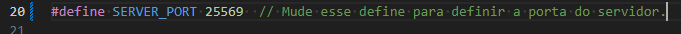
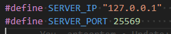
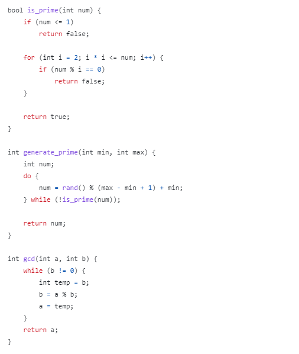
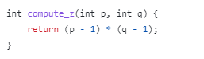
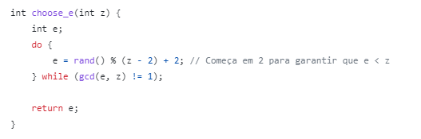
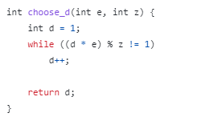

# Laboratório sobre criptografia simétrica e assimétrica

## Fractal


### Observações

#### 1 - Compile usando

```bash
gcc fractal.c -o fractal.bin -lm
```

#### 2 - Rode o programa com

```bash
./fractal.bin 153
```

Para que seja criado um fractal para poder ser utilizado durante as partes do projeto DES e RSA.

## DES

Criptografia simétrica, utilizamos uma PSK para poder fazer a encriptação do fractal gerado.

Utilizamos uma conexão TCP/IP para que seja possível fazer a transferência do arquivo encriptado.

Aqui está uma visão geral simplificada do processo de encriptação DES:

1. Chave de 56 bits: O algoritmo utiliza uma chave de 56 bits para a encriptação. Os outros 8 bits são usados como paridade e não têm efeito na encriptação em si.

2. Geração das sub chaves: A chave de 56 bits é transformada em 16 subchaves de 48 bits cada uma. Essas subchaves são geradas por meio de permutações e deslocamentos.

3. Divisão em blocos: A mensagem de entrada é dividida em blocos de 64 bits.

4. Inicialização: Cada bloco é permutado inicialmente antes de ser processado pelas rodadas.

5. Rodadas (Feistel Network): O bloco de 64 bits é processado em uma série de 16 rodadas idênticas. Cada rodada aplica uma função complexa que envolve substituições, permutações e operações lógicas com as subchaves geradas anteriormente.

6. Permutação final: Após todas as rodadas, é aplicada uma última permutação para reorganizar os bits finais do bloco.

7. Bloco encriptado: O resultado final da encriptação é um bloco de 64 bits transformado.

### Observações

**Verifique se tem um arquivo fractaljulia.bmp na raiz do projeto.**

#### 1 - Compile usando

```bash
1. gcc server.c des.c -O3 -o server.bin -lm -lcrypto 
2. gcc client.c des.c -O3 -o client.bin -lm -lcrypto
```

### Instruções de Uso

#### Configurações

Para poder definir em qual porta o servidor vai rodar.

##### server.c



##### client.c



Configurações para poder dizer onde que o servidor está rodando.

#### 1 - Inicie o servidor

Para que seja possível o cliente fazer a troca de arquivos e chaves.

```bash
    ./server.bin
```

#### 2 - Inicie o cliente

```bash
    ./client.bin ../fractaljulia.bmp
```

## RSA

Vamos explicar as etapas do algoritmo RSA de forma mais detalhada:

1. Seleção de números primos: O algoritmo começa selecionando dois números primos grandes, geralmente com cerca de 1024 bits cada, chamados de p e q. A escolha de números primos é fundamental para a segurança do algoritmo, pois a fatoração de números compostos em seus fatores primos é uma tarefa computacionalmente difícil.

2. Cálculo de n e z: Com os números primos p e q selecionados, calcula-se o produto n = p \* q, que será utilizado na construção das chaves. Também é calculado o valor z = (p - 1) \* (q - 1), que será utilizado na etapa seguinte.

3. Escolha de e: Em seguida, é escolhido um número é, menor que n, que não tenha fatores em comum com z. Números que não compartilham fatores primos com z são chamados de "primos entre si". O valor de e é utilizado para formar a chave pública.

4. Cálculo de d: Após a escolha de e, é calculado o valor de d de forma que a multiplicação de e por d menos 1 seja divisível por z, ou seja, e * d mod z = 1. A existência de d é garantida pelo Teorema de Euler. O valor de d é utilizado para formar a chave privada.

5. Chaves pública e privada: Finalmente, as chaves são formadas. A chave pública consiste no par (n, e), e é utilizada para criptografar dados. A chave privada é formada pelo par (n, d) e é utilizada para descriptografar os dados criptografados com a chave pública. A distribuição segura das chaves é essencial para garantir a segurança do sistema, já que a chave privada não deve ser compartilhada e apenas o detentor da chave privada pode realizar a descriptografia. Com esse conjunto de chaves, o algoritmo RSA oferece uma criptografia segura e amplamente utilizada em comunicações modernas.

### Tentativas

Primeiro tentamos criar a encriptação fazendo os cálculos de cada variável necessária sendo elas P, Q, Z, N, E e D.

#### Cálculo P e Q



#### Cálculo Z



#### Cálculo E



#### Cálculo D



Mas como os números primos que estávamos utilizando tinham entre 5 e 6 dígitos, o D que era necessário para poder encriptar a mensagem ficava muito grande para poder ser computado pelas nossas máquinas.
Por isso acabamos fazendo uma segunda versão utilizando a biblioteca do OpenSSL.

#### Observações

Garanta que está instalado a biblioteca OpenSSL.

```bash
sudo apt-get install libssl-dev
```

### Ordem de execução

```bash
# Para poder gerar os números primos
1. gcc gerarsa.c -lssl -lcrypto -o gerarsa.bin -O3 && ./gerarsa.bin -p

# Para poder gerar a chave .pub e .priv utilizando os primos gerados.
2. gcc gerarsa.c -lssl -lcrypto -o gerarsa.bin -O3 && ./gerarsa.bin -k ./primos.txt

# Inicia o programa para iniciar a comunicação com o cliente.
3. gcc rsa_decrypt.c -lssl -lcrypto -o decrypt.bin -O3 && ./decrypt.bin

# Inicia o programa para iniciar a comunicação com o servidor.
4. gcc rsa_encrypt.c -lssl -lcrypto -o encrypt.bin -O3 && ./encrypt.bin ../fractaljulia.bmp
```
